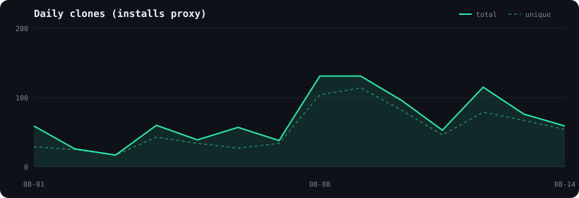

# gtm-cofounder · metrics

_Auto-generated weekly by `.github/workflows/traffic-snapshot.yml`. Last updated: 2026-08-15._

The three signals in one place. **Report skills.sh installs as the headline install number** (it is all-time and CLI-specific).

| Metric | Value | Source | Notes |
|---|---|---|---|
| **skills.sh installs (all-time)** | **1.5K** | skills.sh CLI | scraped 2026-08-14; the cleanest install number |
| **GitHub clones (cumulative, tracked)** | **957** | GitHub traffic | since 2026-08-01; CLI + plugin + manual clone |
| GitHub clones (last 14 days) | 957 (755 unique) | GitHub traffic | rolling |
| GitHub views (cumulative, tracked) | 3,459 | GitHub traffic | since 2026-08-01 |
| Website visitors | 9.9k | Lovable analytics (gtmcofounder.com) | last 14 days, as of 2026-08-14 (manual) |

## What each number is
- **skills.sh installs**: every `npx skills add` install, all-time. Public at <https://skills.sh/aidevgtm/gtm-cofounder> (no login). Coarse to ~0.1K.
- **GitHub clones**: installs via the Claude Code plugin and manual `git clone` that skills.sh doesn't see. Cumulative here only since tracking began (2026-08-01), because GitHub's API only keeps 14 days.
- **Website visitors**: top of funnel. Mostly not your ICP (heavy mobile/India on the last read), so treat installs, not visits, as the result.

## How this updates
- GitHub clones/views: automatic weekly (needs the `TRAFFIC_TOKEN` secret).
- skills.sh installs: automatic weekly scrape of the pack page.
- Website visitors: manual — Lovable has no public API. Edit `metrics/manual.json` when you check the dashboard.
